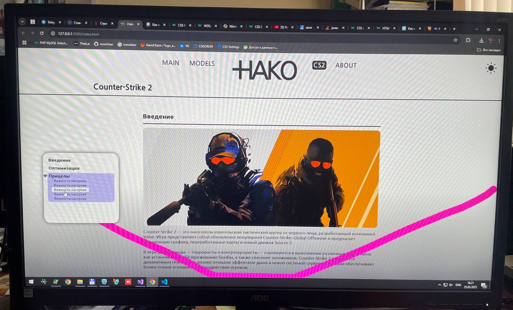
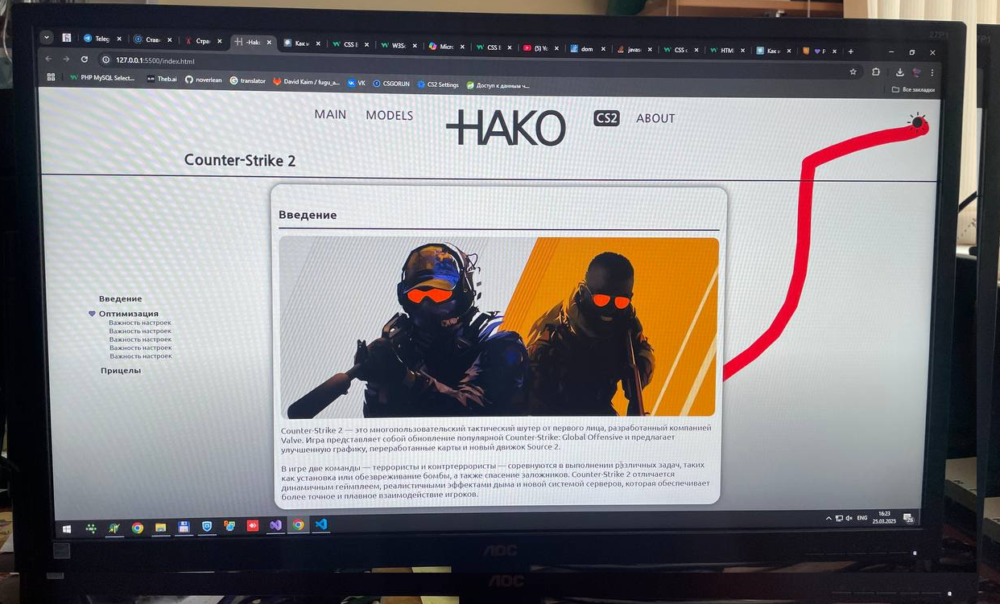

## 🌐 Языки / Languages

- 🇬🇧 [English](README.md)

# 🎯 Hako Designer — Концепт сайта для CS2 игроков

**Hako Designer** — это фронтенд-проект, разработанный как концепт сайта для игроков CS2. Он задумывался как платформа, где можно удобно просматривать и настраивать игровые конфиги, прицелы, настройки чувствительности, а также изучать стили игры популярных игроков. Несмотря на то, что проект был остановлен на ранней стадии, он представляет собой интересную дизайнерскую и техническую основу.

---

## 🧠 Идея проекта

- 💡 Централизованный сайт для CS2-настроек
- 🎮 Просмотр конфигураций и прицелов от профессиональных игроков
- ⚙️ Генератор конфигов и настройка чувствительности
- 📁 Сохранение и экспорт пользовательских конфигураций
- 🧩 Визуальные элементы, вдохновлённые эстетикой CS2 и киберспорта

---

### Фото



---

## 🛠️ Используемые технологии

- HTML  
- CSS (включая кастомные стили и анимации)  
- JavaScript  
- GitHub Pages (планировалась публикация)

---

## 🚀 Запуск проекта

1. Клонируйте репозиторий:
   ```bash
   git clone https://github.com/noverlean/hako_designer.git
   cd hako_designer
   ```
2. Откройте index.html в браузере
💡 Проект работает локально, без сборки и серверной части
